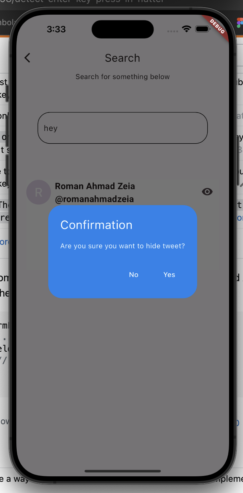

# **Welcome To My Lab Extension For Lab 3 - 4📱**
> By Roman Ahmad Zeia - 100821974 

## This app has many extended features that make the app a responsive and fun app to explore.

### Features Added✅
### - The ability for a user to create a post with a username, name, tweet, and optional image.📸
### - The ability to like, retweet, and bookmark a tweet. (all bookmarked tweets get sent to top of feed using SQL Queries)❤️

### - The ability to reply to a tweet (replies get placed under the parent tweet. A seperate Tweet and Comment class and two seperate tables in a database are made to implement this functonaility)💬

### - The ability to hide a tweet by pressing a hide button, this removes the tweet from your feed.👁️

# Extra Features Added ✅✅✅✅✅✅
## - By pressing the 'Search' Button on the Appbar, you are taken to another page where you can search on a searchbar with words or phrases and that runs through the database and shows the UI a list of tweets that match the phrases or word.  🔎
### (eg: Search for 'cats' --> Result tweet from database: 'its raining cats').

# In app working screenshots 📷
##
### The main page

## The reply functionality

## Posting a tweet

## Searching and filtering tweets

## Another Search and filter result

## Hiding a tweet

